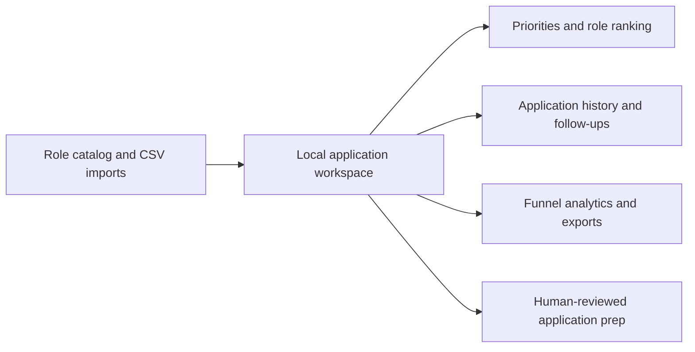

# Application Tracker

Application Tracker is a local-first workspace for managing a job search with less spreadsheet friction. It brings role discovery, application history, follow-ups, and progress signals into one calm, reviewable place.

## Why I built it

Job searching creates a surprising amount of busywork: comparing roles, remembering follow-ups, tailoring materials, and understanding where applications are getting stuck. I built this project to turn that process into a clearer system while keeping important decisions human-reviewed.

## What it does

- Helps compare roles by fit, location, compensation, timing, and personal priorities.
- Tracks applications, responses, deadlines, notes, resume versions, and follow-ups.
- Imports and exports CSV trackers.
- Shows funnel progress such as submissions, screens, pending responses, and response time.
- Prepares evidence-based resume suggestions without submitting applications automatically.

## Architecture



## Run locally

```bash
npm install
npm start
```

Open `http://localhost:4177`.

## Project status

This is a personal productivity tool and an ongoing experiment in building safer, more thoughtful application workflows.
